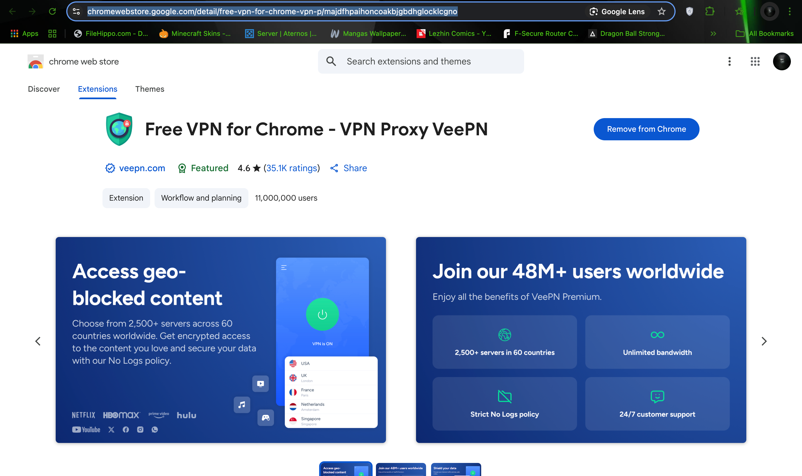
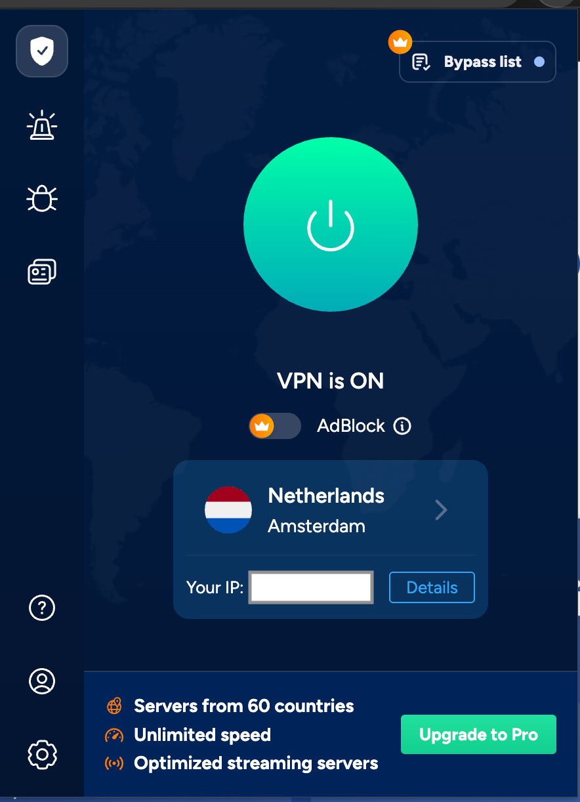
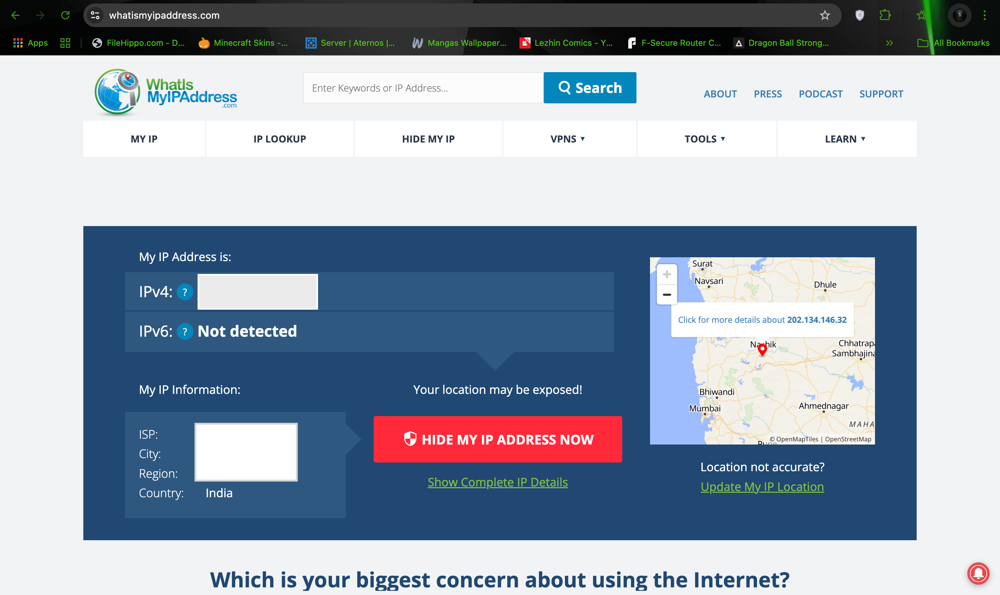
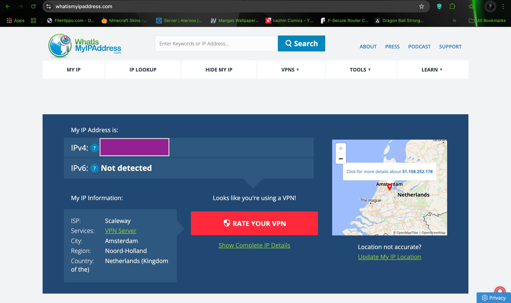
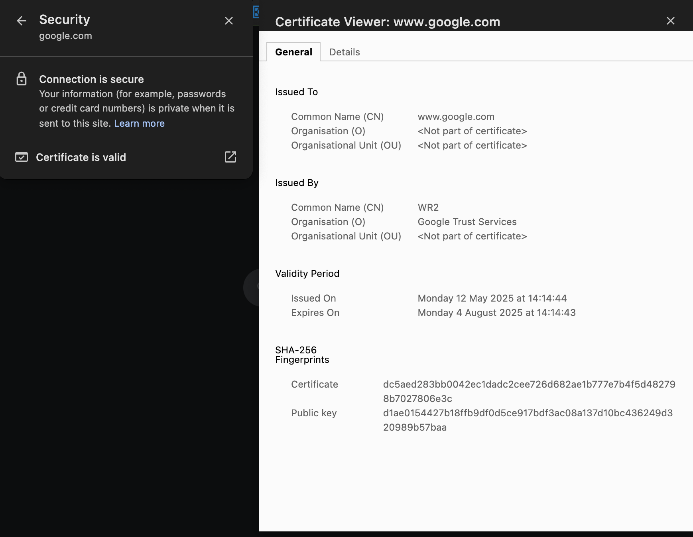

# Working-with-VPNs

This project demonstrates how Virtual Private Networks (VPNs) help protect user privacy and enable secure communication online. It involves hands-on steps using a Chrome-based VPN extension and highlights VPN functionality, encryption, and performance considerations.

## 📌 Objective

To explore how VPNs change IP addresses, encrypt traffic, affect browsing speed, and contribute to secure and private internet usage.

---

## ✅ Tasks Completed

### 1. **Chosen VPN Service**
- **VPN Used:** [Free VPN for Chrome – VPN Proxy VeePN](https://chrome.google.com/webstore/detail/free-vpn-for-chrome-vpn-pr/oppjbgbfjejepdblkkkblfemjplmepce)
- Downloaded and installed via Chrome Web Store.

📸 **Screenshot:**

---

### 2. **Installation and Connection to VPN Server**
- Installed the VPN extension in Chrome.
- Signed up for a free account.
- **Server Location Selected:** Amsterdam
- Successfully connected.

📸 **Screenshot:**

---

### 3. **IP Address Verification**
- Verified IP address change using [WhatIsMyIPAddress.com](https://whatismyipaddress.com).

📸 **Screenshots:**
- Before VPN:  
  

- After VPN (Amsterdam IP):  
  

---

### 4. **Traffic Encryption Confirmation**
To confirm encrypted traffic:
- Visit any secure website (e.g., `https://example.com`).
- Click the lock icon in Chrome’s address bar.
- Click “Connection is secure” → then “Certificate” to view HTTPS encryption details.

📸 **Screenshot:**

---

### 6. **VPN Disconnected – Speed/IP Comparison**
- Disconnected from the VPN.
- Compared IP and browsing speed on the same website.
- Used the online website https://speedof.me/ to test the speed of local network and vpn.

📸 **Screenshot(Local):**
.png)

📸 **Screenshot(VPN):**
.png)

---

### 7. **VPN Encryption & Privacy Features Research**
- VPNs use protocols like **OpenVPN**, **WireGuard**, and **IKEv2/IPSec**.
- Key privacy features:
  - IP masking
  - No-log policies (provider dependent)
  - DNS leak protection
  - Kill switches

---

### 8. **Summary of VPN Benefits & Limitations**

#### ✅ Benefits:
- Hides real IP address
- Encrypts internet traffic
- Secures public Wi-Fi usage
- Bypasses regional restrictions

#### ⚠️ Limitations:
- Free VPNs may collect logs or display ads
- Can slow down internet speed
- Not a full substitute for antivirus or secure browsing practices
- Trust in the provider is essential

---

## 🛡️ Conclusion

VPNs are powerful tools for enhancing digital privacy and securing online activities. This project provided practical experience in setting up, using, and analyzing the effectiveness of a VPN for everyday use.

---

## 📸 Screenshots

All screenshots are stored in the `screenshots/` folder and embedded above under each respective section.

---

## 📝 License

This project is licensed under the [MIT License](LICENSE). You are free to use, modify, and distribute this project with proper attribution.
